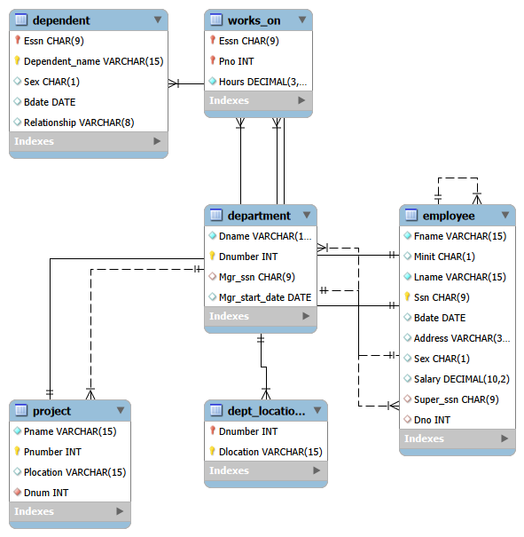
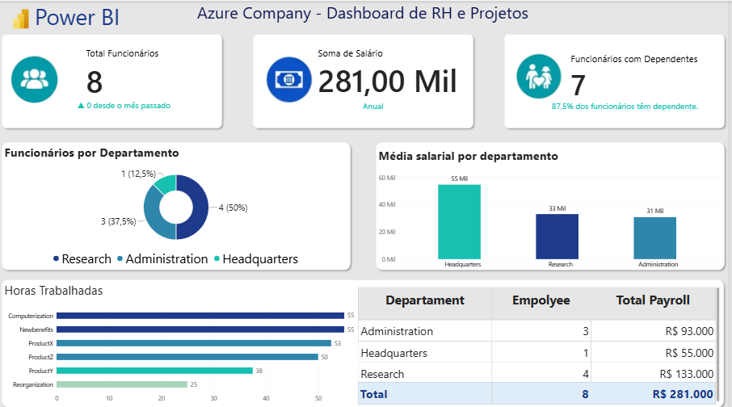

# 🏢 Azure Company - HR and Projects Dashboard

> Projeto desenvolvido no Bootcamp da DIO - Processamento de dados com Power BI
> 

---

### 🗄️ Modelagem do Banco - MySQL Workbench

> Diagrama relacional criado no MySQL Workbench

**Tabelas:** `Company`, `Departments`, `Employee`, `Payroll`, `Projects`

Relacionamentos:
- `Employee.Department_ID` -> `Departments.ID`
- `Payroll.Employee_ID` -> `Employee.ID`
- `Projects.Department_ID` -> `Departments.ID`

---

### 📊 Dashboard Final
> Print do Dashboard conectado com Power Bi
> ### 📊 Dashboard Final - Power BI

*Total de 8 funcionários | Soma de Salários: R$ 281k | Distribuição por departamento*

---

### 🛠️ Como foi feito

1.  Criei o banco de dados MySQL localmente no Workbench com as tabelas `Company, Departments, Employee, Payroll e Projects`, seguindo a mesma estrutura proposta para a Azure.
2.  Conectei o Power BI Desktop direto no MySQL usando o conector nativo.
3.  Apliquei **Mesclar Consultas (Merge)** para relacionar as tabelas e criar o modelo estrela para o dashboard.
4.  Criei os visuais de RH: Total de 8 Funcionários e Soma de Salários por Departamento.

---

### 🔄 Conceito Chave: Mesclar vs Combinar Consultas

**1. O que é MESCLAR CONSULTAS (Merge Queries)?**
É um `JOIN` horizontal. Une colunas de tabelas diferentes usando uma chave em comum.
Ex: Trazer o `Nome do Departamento` para dentro da tabela `Employee`.

**2. O que é COMBINAR / ANEXAR CONSULTAS (Append Queries)?**
É um `UNION` vertical. Empilha linhas de tabelas que tem a MESMA estrutura.
Ex: Juntar `Funcionarios_Jan` + `Funcionarios_Fev`.

**3. Por que usei SÓ MESCLAR nesse projeto e NÃO Combinar?**

Porque nossas tabelas têm estruturas DIFERENTES e são relacionais. Se eu usasse Combinar, o Power BI iria empilhar salário com nome de departamento, gerando linhas nulas e duplicando os valores. Minha soma de R$ 281k ficaria errada.

Usando **Mesclar (Merge)**, eu preservei o modelo relacional:
- `Payroll` + `Employee` = sei quanto cada pessoa ganha
- `Employee` + `Departments` = sei de qual dept ela é

Resultado: Dashboard correto, sem duplicidade. Mesclar é para relacionar, Combinar é para unir tabelas iguais.

---
Feito por Melissa Machado para o desafio da DIO.
